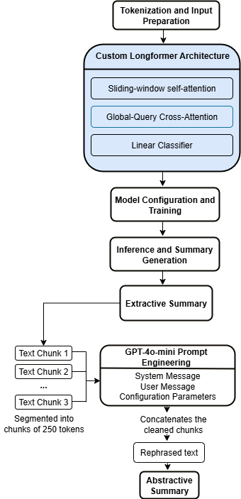

# Hallucination Mitigation in Long-Document summarization

## Abstract

Abstractive summarization of long scientific documents, such as ArXiv
preprints and PubMed biomedical articles remains a challenging open problem
in Natural Language Processing. State-of-the-art sequence-to-sequence models
frequently produce summaries that are fluent yet factually inconsistent with
their source documents, a phenomenon known as *hallucination*. This repository
implements a complete, reproducible research pipeline that directly attacks
this problem through a two-stage hybrid framework:

1. **Extractive grounding**: a Longformer-based encoder augmented with a
   learnable cross-attention head (and a DistilBERT sentence-level classifier
   as a comparative baseline) selects the most salient sentences from a
   document, producing a factually grounded extractive summary.
2. **Controlled abstractive refinement**: a four-stage GPT self-critique loop
   (fact extraction → guided rewrite → self-critique → automated revision)
   rewrites each extractive chunk into fluent academic prose while being
   explicitly anchored to extracted (subject, predicate, object) fact triples,
   suppressing the introduction of unsupported content. A T5 seq-to-seq model
   serves as a second abstractive baseline for comparison.

Factual consistency is evaluated quantitatively via BERTScore semantic
similarity and a GPT-based FactCC probe (SUPPORTS / NOT\_SUPPORTS with a
continuous confidence score), supplemented by standard ROUGE-1/2/L metrics for
coverage.

## Project Highlights

- Novel hybrid extractive–abstractive summarization framework
- Custom Longformer with Cross-Attention sentence extraction
- GPT-4o-mini self-critique rewriting pipeline for hallucination mitigation
- DistilBERT and T5 baselines for comparison
- Evaluated on ArXiv and PubMed scientific summarization benchmarks
- Automated evaluation using ROUGE, BERTScore, and GPT-based FactCC

## Overall System Architecture

The proposed framework consists of a two-stage summarization pipeline. A custom Longformer-based extractive model first identifies salient evidence sentences from long scientific documents. These extracted summaries are subsequently refined by a GPT-based self-critique rewriting pipeline to improve fluency while preserving factual consistency. DistilBERT and T5 are implemented as baseline models for comparative evaluation.

<p align="center">
  
</p>

<p align="center">
  <em>Figure 1. Overall architecture of the proposed framework.</em>
</p>
     
---

## Repository Structure

```
hallucination_mitigation_nlp/
├── main.py                  ← Single entry point; orchestrates the complete pipeline
├── requirements.txt         ← Python dependencies
├── README.md                ← Project documentation
├── images/                  ← Architecture and workflow figures used in the README
│   ├── architecture_approach.png
│   └── abstractive_pipeline.png
└── src/
    ├── __init__.py
    ├── utils.py             ← Configuration, logging, path helpers, and I/O utilities
    ├── data_processing.py   ← Dataset downloading, preprocessing, TF-IDF oracle generation, and BERTScore evaluation
    ├── models.py            ← Longformer, DistilBERT, T5, GPT self-critique pipeline, and training workflows
    └── evaluation.py        ← ROUGE, BERTScore, FactCC evaluation frameworks
```

### `src/` Module Responsibilities

- **`src/utils.py`**
  - Central configuration constants (`TRAIN_SIZE`, `VAL_SIZE`, `TEST_SIZE`,
    `GPT_MODEL`, `CHUNK_TOKEN_SIZE`, etc.).
  - `build_paths(base_dir)`: constructs and creates all project directories
    from a single root path, making the codebase environment-agnostic.
  - `setup_logging(log_dir)`: configures a dual file+stdout logger.
  - `chunk_by_tokens(text)`: tiktoken-based sentence-boundary-aware text
    chunker used by the GPT rewrite pipeline.
  - `safe_batch_decode(preds, tokenizer)`: robust conversion from logit or
    token-ID arrays to decoded strings, handling 1D/2D/3D inputs and
    vocabulary clamping.
  - General I/O helpers: `save_json`, `save_jsonl`, `load_jsonl`,
    `inspect_jsonl`.

- **`src/data_processing.py`**
  - `download_datasets(dataset_path)`: downloads ArXiv and PubMed JSONL
    splits from the Hugging Face Hub via `wget`.
  - `load_custom_dataset(dataset_name, dataset_path)`: loads raw JSONL data
    into a typed HuggingFace `DatasetDict` with a fixed feature schema.
  - `tfidf_oracle(text_sentences, top_k)`: TF-IDF sentence scoring and
    top-*k* selection for oracle extractive summary generation.
  - `generate_tfidf_oracle_dataset(dataset_dict)`: in-memory oracle
    annotation of all splits; returns an enriched `DatasetDict`.
  - `generate_and_save_trimmed_split(...)`: production-scale enriched JSONL
    serialisation with configurable sample limits.
  - `build_enriched_datasets(dataset_path)`: end-to-end orchestrator for
    both ArXiv and PubMed enriched dataset creation.
  - `load_cleaned_enriched_split(jsonl_path)`: drops auxiliary schema fields
    that cause type conflicts before BERTScore evaluation.
  - `bertscore_pairwise(oracle, gold)`: per-example BERTScore computation.
  - `evaluate_bert_similarity(dataset_dict, split_name)`: batch BERTScore
    oracle-vs-gold evaluation.
  - `run_bertscore_evaluation(dataset_path)`: full evaluation across all
    splits of both datasets.

- **`src/models.py`**
  - `call_openai_chat(messages, ...)`: OpenAI Chat Completions wrapper with
    exponential back-off retries.
  - `rewrite_with_self_critique(chunk)`: four-stage GPT rewrite pipeline
    (fact extraction → guided rewrite → self-critique → automated revision).
  - `run_rewrite_pipeline(base_dir)`: iterates over all extractive summary
    files and applies `rewrite_with_self_critique` chunk by chunk.
  - `LongformerWithCrossAttention`: custom `nn.Module` extending
    `allenai/longformer-base-4096` with a multi-head cross-attention layer
    and token-level binary classifier.
  - `SavePretrainedCallback`: HuggingFace `TrainerCallback` that persists
    the custom model's state dictionary at every checkpoint.
  - `SummaryGenerator`: inference wrapper that scores tokens, aggregates
    per sentence, and selects top-*k* sentences.
  - `LongformerExtractor`: end-to-end training/loading manager: handles
    checkpoint resumption, label alignment, ROUGE compute\_metrics, and
    final model serialisation.
  - `build_sentence_dataset(ds_dict)`: flattens document-level data into
    sentence-level binary classification examples for DistilBERT.
  - `get_distilbert_trainer(...)`: configures a HuggingFace Trainer with
    ROC-AUC evaluation for the DistilBERT sentence classifier.
  - `train_distilbert_baselines(arxiv_ds, pubmed_ds, output_dir)`: trains
    both ArXiv and PubMed DistilBERT classifiers.
  - `load_and_split_extractive_preds(input_file)`: loads extractive
    prediction JSONL files and creates train/val/test folds for T5.
  - `preprocess_for_t5(datasets, tokenizer, ...)`: tokenises
    prediction/reference pairs for seq-to-seq training.
  - `run_t5_abstractive_pipeline(...)`: full T5 fine-tuning and evaluation
    loop with BERTScore and GPT FactCC output.

- **`src/evaluation.py`**
  - `evaluate_summaries(refs, gens)`: per-pair ROUGE-1/2/L scorer returning
    a pandas DataFrame.
  - `evaluate_model(dataset_name, model_fn, ...)`: test-set evaluator for
    any callable extractive model; computes ROUGE against oracle summaries.
  - `evaluate_extractive_distilbert(trainer, tokenizer, raw_ds, ...)`: 
    DistilBERT inference with top-*k* sentence selection and ROUGE scoring.
  - `compute_bertscore(refs, hyps)`: corpus-level BERTScore (P/R/F1).
  - `compute_factcc_via_gpt(refs, hyps)`: GPT-based FactCC probe with
    SUPPORTS/NOT\_SUPPORTS labels and continuous confidence scores.
  - `load_reference_summaries(path)`: reads ground-truth JSONL summaries.
  - `load_generated_summaries(dirpath)`: reads numbered `.txt` summary
    files produced by the rewrite pipeline.
  - `load_and_preprocess_test_dataset(dataset_name, drive_path)`: loads and
    normalises the raw test JSONL with a dynamically inferred schema.
  - `evaluate_all(base_dir, datasets)`: master evaluation entry point:
    aligns indices, runs BERTScore + FactCC, saves JSON results.

---

## Dataset Provenance

This pipeline is built and evaluated on standard long-document NLP benchmarks sourced from the Hugging Face Hub (maintained by the `ccdv` group):

- **ArXiv Summarization Dataset**: [ccdv/arxiv-summarization](https://huggingface.co)
- **PubMed Summarization Dataset**: [ccdv/pubmed-summarization](https://huggingface.co)

The `src/data_processing.py` engine automates the retrieval, parsing, and structured segmentation of these datasets into unified local JSONL schemas.


## Setup and Installation

### Prerequisites

- Python 3.10 or later
- CUDA-capable GPU (recommended; the Longformer training stage requires at
  least 16 GB VRAM for `allenai/longformer-base-4096` with `fp16=True`)
- An [OpenAI API key](https://platform.openai.com/account/api-keys) for the
  GPT rewrite and FactCC stages

### 1. Clone the repository

```bash
git clone https://github.com/<your-username>/hallucination_mitigation_nlp.git
cd hallucination_mitigation_nlp
```

### 2. Create and activate a virtual environment

```bash
python -m venv .venv
source .venv/bin/activate        # Linux / macOS
# .venv\Scripts\activate.bat     # Windows
```

### 3. Install dependencies

```bash
pip install --upgrade pip
pip install -r requirements.txt
```

### 4. Set your OpenAI API key

```bash
export OPENAI_API_KEY="sk-..."   # Linux / macOS
# set OPENAI_API_KEY=sk-...      # Windows CMD
```

### 5. Download NLTK data (one-time)

```python
python -c "import nltk; nltk.download('punkt'); nltk.download('punkt_tab')"
```

---

## Running the Pipeline

### Full end-to-end pipeline

```bash
python main.py \
    --base_dir /data/thesis_project \
    --stages all \
    --datasets arxiv_enriched,pubmed_enriched
```

### Run individual stages

```bash
# 1. Download raw datasets
python main.py --base_dir /data/thesis_project --stages download

# 2. Build TF-IDF enriched datasets
python main.py --base_dir /data/thesis_project --stages build_datasets

# 3. Evaluate oracle quality with BERTScore
python main.py --base_dir /data/thesis_project --stages bertscore_eval

# 4. Train Longformer extractor and generate summaries
python main.py --base_dir /data/thesis_project --stages longformer

# 5. Train DistilBERT sentence-level baseline
python main.py --base_dir /data/thesis_project --stages baseline_distilbert

# 6. Fine-tune T5 abstractive baseline
python main.py --base_dir /data/thesis_project \
    --stages baseline_t5 \
    --t5_model t5-base \
    --t5_max_input_length 512 \
    --t5_max_target_length 128 \
    --t5_epochs 3

# 7. GPT self-critique abstractive rewrite
python main.py --base_dir /data/thesis_project --stages rewrite

# 8. BERTScore + FactCC evaluation of rewritten summaries
python main.py --base_dir /data/thesis_project --stages evaluate

# 9. Inspect generated prediction files
python main.py --base_dir /data/thesis_project --stages inspect
```

### Combining stages

```bash
python main.py \
    --base_dir /data/thesis_project \
    --stages longformer,rewrite,evaluate
```

---

## Key Outputs

After a full pipeline run the following outputs are written under `<base_dir>`:

| Path | Contents |
|---|---|
| `dataset/arxiv_enriched/{train,val,test}.jsonl` | TF-IDF oracle-annotated ArXiv splits |
| `dataset/pubmed_enriched/{train,val,test}.jsonl` | TF-IDF oracle-annotated PubMed splits |
| `models/<dataset>/final_model/pytorch_model.bin` | Best Longformer model weights |
| `summaries/<dataset>/<idx>.txt` | Longformer extractive summaries |
| `abs_summaries/<dataset>/test_summaries/<idx>.txt` | GPT-rewritten abstractive summaries |
| `abs_summaries/<dataset>/evaluation_results.json` | BERTScore + FactCC results |
| `baselines/distilbert/<dataset>/test_predictions.jsonl` | DistilBERT predictions |
| `baselines/distilbert/<dataset>/test_rouge.json` | DistilBERT ROUGE scores |
| `abstractive_t5/<dataset>/metrics/test_metrics.json` | T5 BERTScore + FactCC |
| `abstractive_t5/<dataset>/summaries/test_abstractive.jsonl` | T5 predictions |
| `results/<dataset>_results.csv` | Longformer ROUGE summary |
| `logs/main_pipeline.log` | Full pipeline execution log |

---

## Citation

This work is under review at the moment. 
---

## License

This project is released for academic and research use.
